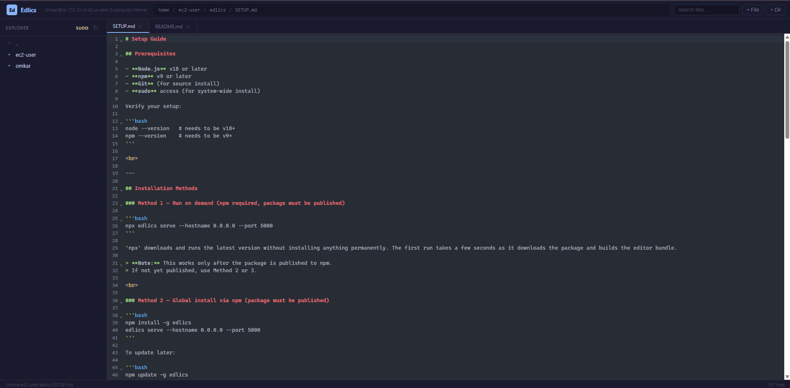

<p align="center">
  
</p>

<h1 align="center">Edlics</h1>

<p align="center">
  <strong>Edit files on your Linux server from a browser</strong>
  <br>
  No terminal editors needed. Just open a web page and start editing.
</p>

<p align="center">
  <a href="SETUP.md"></a>
  <a href="SETUP.md"></a>
  <a href="#usage"></a>
  <a href="LICENSE"></a>
</p>

<br>

## The Problem

You have a Linux server (like an AWS EC2). You need to edit config files, write code, or fix something. Normally you have to:

- SSH into the server
- Use `vim` or `nano` in the terminal
- Remember keyboard shortcuts
- Can't use your mouse
- Can't see a file explorer

It works, but it's slow and annoying — especially if you're more comfortable with a proper code editor like VS Code.

## The Solution

Edlics turns your server into a web-based code editor. Run one command, open a URL in your browser, and you get:

- A **file explorer** on the left — click folders to browse
- A **code editor** with colors and line numbers
- **Right-click** to rename, delete, copy paths
- **Search** to find files quickly
- **Keyboard shortcuts** like Ctrl+S to save

No SSH skills required beyond the initial setup. Works on any Linux server.

<br>

## Quick start

```bash
npx edlics serve --hostname 0.0.0.0 --port 5000
```

Open `http://localhost:5000` in your browser.
VPN : Open `http://privateIP:5000` in your browser.
public : Open `http://publicIP:5000` in your browser.

> See [SETUP.md](SETUP.md) for all install methods and troubleshooting.

<br>

## Features

| | |
|---|---|
| **File browser** | Flat file tree with directory navigation, hidden file dimming, search |
| **Code editor** | CodeMirror 6 with syntax highlighting for JS, TS, Python, HTML, CSS, JSON, Markdown, XML, YAML |
| **File operations** | Create, rename, delete files and folders — right-click context menu |
| **Dark / Light theme** | Click the moon/sun icon to switch. Preference is saved automatically |
| **Server info** | Shows which user is logged in, the server hostname, and private IP |
| **Clickable path bar** | Click any directory in the breadcrumb to jump to it |
| **Sudo support** | Edit protected files. Password prompt for users who need it, auto-escalation for NOPASSWD users |
| **No database** | Works directly on the filesystem — what you see is what's on disk |
| **Async by design** | Non-blocking file I/O, handles large files without hiccups |

<br>

## Usage

```text
edlics serve [options]

Options:
  --hostname   Host to bind to (default: 127.0.0.1)
  --port       Port to listen on (default: 3000)

Examples:
  edlics serve
  edlics serve --hostname 0.0.0.0 --port 5000
```

<br>

## Keyboard shortcuts

| Shortcut | Action |
|----------|--------|
| `Ctrl+S` | Save file |
| `Ctrl+P` | Search files |
| `Ctrl+W` | Close tab |
| `F2` | Rename file |
| `Escape` | Close dialogs / menus |

<br>

## Screenshots



<br>

## How it works

Edlics is a single Node.js file that starts a web server on your Linux machine.

1. You run `edlics serve` — it starts a web server on the port you choose
2. You open `http://your-server-ip:5000` in your browser
3. The left panel shows your files and folders (like a file explorer)
4. Click a file — it opens in the editor panel with syntax coloring
5. Edit, save, create, rename, delete — all from the browser
6. The server reads and writes files directly on the filesystem

That's it. No database, no configuration, no complicated setup.

<br>

## Project structure

```text
edlics/
├── bin/
│   └── edlics.js          # The server (Node.js)
├── brand/
│   └── logo.svg           # Project logo
├── bundle/
│   └── editor.mjs         # CodeMirror 6 build entry
├── public/
│   ├── editor.mjs         # Pre-built editor bundle
│   └── index.html         # The web page you see in browser
├── .gitignore
├── README.md
├── SETUP.md               # Detailed install guide
├── install.sh             # Symlinks edlics to /usr/local/bin
└── package.json           # Dependencies + build scripts
```

<br>

## Tech stack

- **Frontend:** Plain JavaScript, CodeMirror 6, CSS custom properties
- **Backend:** Node.js (bare `http` module — no frameworks)
- **Editor:** CodeMirror 6 with syntax highlighting, bracket matching, undo history
- **Theme:** Dark theme by default, light theme toggle available

<br>

## License

MIT — use it, share it, build on it.
